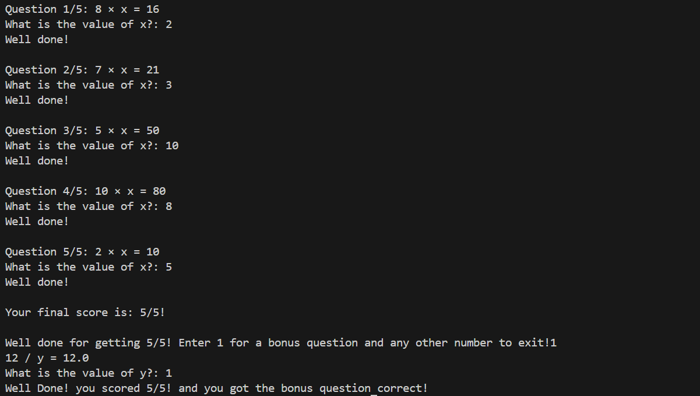

# Multiplication Quiz User Guide 🌟

## Introduction

The Multiplication Quiz Game is a simple and fun terminal game designed to help users practice and improve their math skills! The game includes five multiplication questions and a bonus division question for those who get all the 5 multiplication questions correct.

## User Guide

This program is a fun and engaging way to sharpen your math skills. It’s ideal for students or anyone looking to test their multiplication and division knowledge in a simple, interactive format where your score is calculated each round!

### Features
- Five randomly generated multiplication questions.
- Bonus division question for players who score 5/5.
- feedback straight away on whether your answers are correct.
- Score tracking to monitor your performance.

### What You’ll Need
- A Python environment (3.7 or later) installed on your computer.
- Access to a terminal or command prompt. The terminal is a window that will pop up once you run the code, this is where you will be able to see the questions and input your answers.

### How to Play
1. Open your terminal or command prompt.
2. Run the game by executing the `main.py` file.
3. For each question, calculate the value of `x` or `y` and type your answer when prompted.
4. Receive instant feedback for each answer and keep track of your score.
5. If you score 5/5 on the quiz, you’ll be offered a bonus division question for an extra challenge.
6. At the end, view your total score.

#### Example Gameplay

Here’s what the game looks like:

```plaintext
Welcome to the Multiplication Quiz Game!

Question 1/5: 3 × x = 9
What is the value of x?: 3
Well done!

Question 2/5: 6 × x = 18
What is the value of x?: 3
Well done!

Your final score is: 5/5!

Well done for getting 5/5! Enter 1 for a bonus question or any other number to exit: 1

Bonus Question: 12 / y = 6.0
What is the value of y?: 2
Well Done! You scored 5/5 and got the bonus question correct!

Thank you for playing!
```




# Technical Documentation 

## Overview

This program is a Python terminal-based game that tests users' math skills. It includes five multiplication questions, with an additional bonus division question if the user scores a 5/5. The program is split into two files for modularity: one for the main logic `main.py` and another for the required functions `functions.py`.

---

## Code Structure

The program is structured in two files:

1. **`main.py`:**
   - Contains the primary game logic.
   - Handles the user interface in the terminal.
   - Manages scoring and bonus question logic.
   - imports functions needed.

2. **`functions.py`:**
   - reusable functions for generating questions and validating user input.

---

## `functions.py`

This file contains three functions:

### **1. `question()`**
- **Purpose:** Generates a random multiplication question.
- **Returns:** A tuple of two integers (`num_1`, `num_2`) and their product (`answer`).
- **Example Usage:**
  ```
  num_1, num_2, answer = question()
  print(f"{num_1} × x = {answer}")
  ```
### **2. `bonus_question()`**
- **Purpose:** Generates a random divison question.
- **Returns:** A tuple of two integers (`num_1`, `num_2`) and their quotient (`answer`).
- **Example Usage:**
  ```
  num_1, num_2, answer = bonus_question()
  print(f"{num_1} / y = {answer}")
  ```
  
### **3. `get_valid_input(prompt)`**
- **Purpose:** Ensures that the user inputs a valid integer.
- **Parameters:**
  - `prompt (str)`: The message displayed to the user.
- **Returns:** A valid integer.
- **Example Usage:**
  ```
  user_input = get_valid_input("What is the value of x?: ")
  ```

  
---
  ## `mains.py`

this is the file that should be run the game.

 **Initialize Score:**  
   The program starts by initializing the score to `0`.

2. **Generate Multiplication Questions:**  
   A loop iterates five times, calling the `question()` function from `functions.py`. The user is prompted to solve each question, and their score is updated for correct answers, 

3. **Display Final Score:**  
   After all five questions, the program displays the user’s total score.

4. **Bonus Question:**  
   If the user scores 5/5, a bonus question pops up: a division question generated by the `bonus_question()` function. Feedback is provided based on their response.if the user inputs 1 the question will be sent if not the quiz ends.

5. **Exit Logic:**  
   The program exits after the quiz or bonus round.


